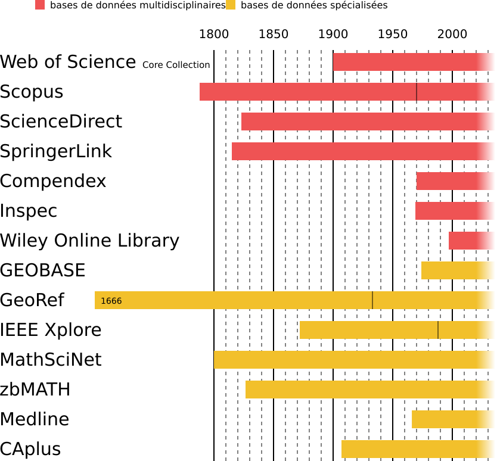

## Taille et couverture temporelle

Voici une vue d'ensemble des bases de données présentées pour voir en comparer la taille et la couverture temporelle.   
Seules les bases de données multidisciplinaires et spécialisées sont représentées ici, car les données concernant les autres ressources ne sont pas connues ou suffisamment précises pour être comparées.

### Couverture temporelle

   

### Taille

